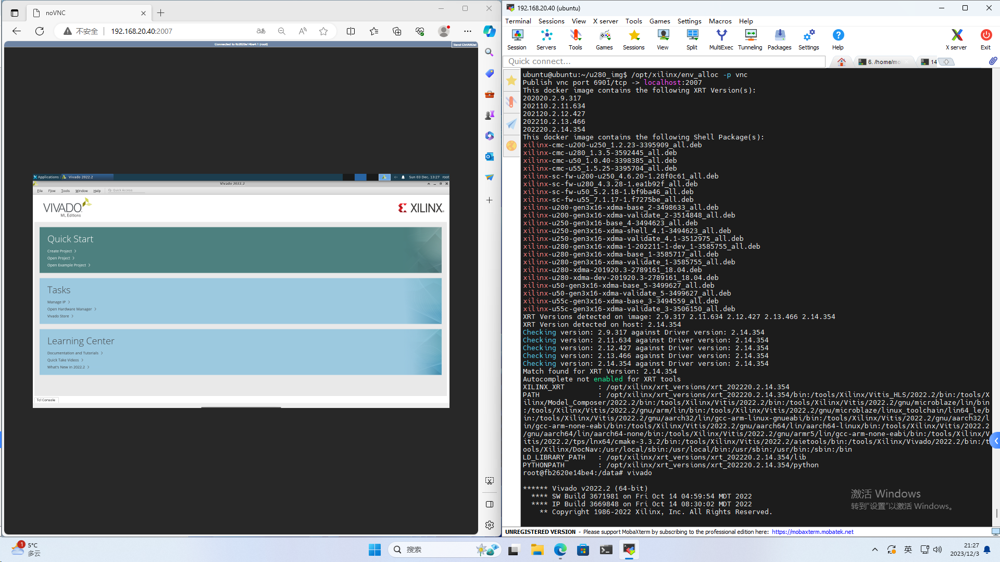

# Guide for Lab502 Server with Xilinx Cards v0.3

English | [Chinese](./README_CN.md)

By Qianyu Cheng (qycheng@mail.ustc.edu.cn) 

**Note: Tutorial in Chinese is [here](./for_newbie.md)!!!**

Date: 2023/12/29
## Feature Overview
- Security
  - Disable `sudo` for all users (except `ubuntu`) and `XRT/setup.sh` configuration
  - Allocate, execute and deallocate the environment in container mode (based on our scripts)
    ```bash
    env_alloc [-d <DeviceID[,...]>] [-e] [-p <APP=jupyter|vnc>] [-i <IMAGE_NAME>] # allocate
    env_exec # execute
    env_dealloc # deallocate
    ```
  - Reserve data in `/data` directory of the container only (i.e. `/home/$USER` directory of the host)
  - User creation script (`sudo` permission needed)
    ```bash
    /home/ubuntu/new_user_init.sh <username>
    ```
- Resource Management
  - Allocate FPGA cards (`-d DeviceID,...`)
  - Shared/exclusive allocation (with `-e` or without `-e`)
  - Release FPGA cards with timers (after 3 hours)
- Service
  - `Portainer` (Web-based container management) support (`https://<IP>:2000`)
  - Multi-version environment switched by `-i xilinx-u280:{2020.2|2021.2|2022.2|2023.2}`
  - Create an extended environment by `Dockerfile` from `xilinx-u280:2022.2` environment
    - [Template](./Dockerfile) 
  - `Jupyter Lab` (Python IDE) and `noVNC` (Web-based remote desktop) support (`-p jupyter|vnc`)
  - Automatic port forwarding in `<IP>:2001-2010`
- Known Issue
  - Unstable file ownership in `/home/$USER` directory (was set to `root`)
    - Mitigation: change file ownership inside the container environment with `chown <HOST_UID>`


