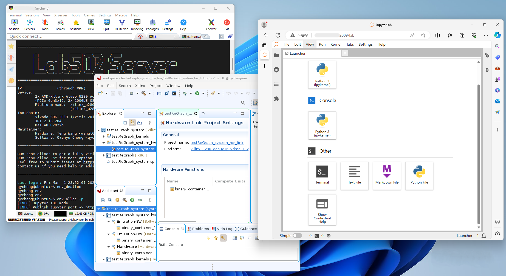

# Guide for Lab502 Server with Xilinx Cards v0.3

[English](./README.md) | Chinese

By Qianyu Cheng (qycheng@mail.ustc.edu.cn) 

Date: 2023/12/29
## Feature Overview
U280服务器维护已基本完成，提供特性如下：
- 数据安全
  - 用户环境禁用 `sudo` 权限 (除 `ubuntu`), `XRT/setup.sh` 环境配置
  - 仅限以容器模式分配，进入，释放完整开发环境 (基于提供的脚本)
    ```bash
    env_alloc [-d <DeviceID[,...]>] [-e] [-p <APP=jupyter|vnc>] [-i <IMAGE_NAME>] # 分配
    env_exec # 进入
    env_dealloc # 释放
    ```
  - 数据完全隔离, 仅限在容器环境 `/data` (用户环境 `/home/$USER`) 目录内读写、保留数据
  - 使用脚本创建用户，避免错误授权 (需要 `sudo` 权限)
    ```bash
    /home/ubuntu/new_user_init.sh <username>
    ```
- 资源管理
  - 选择分配板卡 (`-d DeviceID,...`)
  - 共享/独占分配板卡 (使用 `-e` 或不使用 `-e`)
    - TODO: 限额分配
  - 定时释放板卡 (分配三小时后)
- 服务接口
  - 提供网页端容器管理 `Portainer`, 可通过 `https://<IP>:2000` 访问 
  - 提供多版本运行环境，通过 `-i xilinx-u280:{2020.2|2021.2|2022.2|2023.2}` 切换，后续用户可基于 `Dockerfile` 构建扩展环境
    - [Template](./Dockerfile) 
  - 提供 `Jupyter Lab` (Python IDE) , `noVNC` (网页远程桌面) 服务支持 (`-p jupyter|vnc`)
  - 提供开放端口池，自动进行容器->主机端口映射，可使用浏览器通过 `<IP>:2001-2010` 访问
- 已知问题
  - 退出后直接释放容器，不保留 `/data` 目录外的其他运行时数据
  - 在容器 `/home/$USER` 目录内读写文件，返回用户环境后可能引发权限问题 (文件所有权被设为root)
    - 缓解措施: 提前记下用户 `$UID`, 在容器内使用`chown <HOST_UID>`修改所有权


