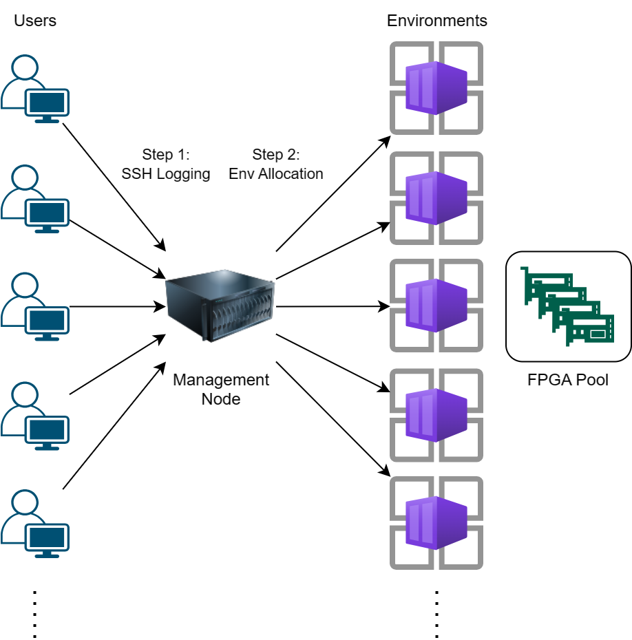
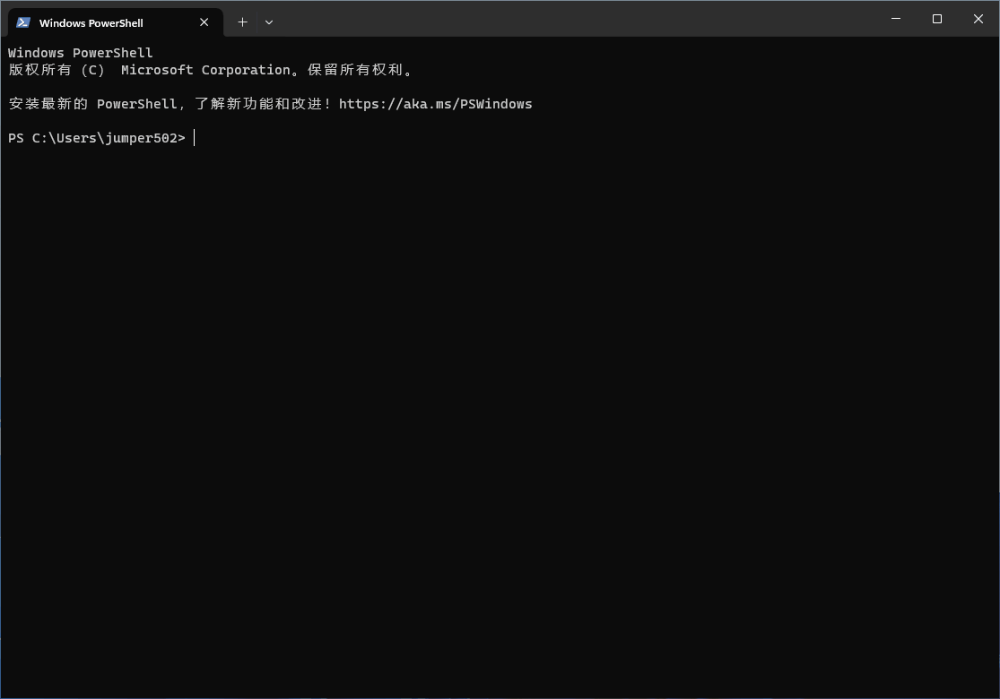

# 一些傻瓜教程
对 tutorial 有疑问，欢迎通过 issue 或 pull request 提出。

如需了解 FPGA 开发工具 Vitis 的工作流程，请参考 [Vitis 工作流教程](https://github.com/Reconfigurable-Computing/Vitis_workflow)中针对 U50 板卡的章节。


## Step 0: 登入 VPN 服务
为了保证安全性，需要通过 VPN 接入服务器所在网段。在使用服务器前，请下载 [EasyConnect](https://support.sangfor.com.cn/productSoftware/list?product_id=20&category_id=56) 并登入 VPN 服务。

**Note: 请联系管理员申请 VPN 账号与服务器账号。**
## Step 1: 登入服务器
我们建议使用 SSH 协议登入服务器。一般而言, VSCode/MobaXterm/Windows 终端都是优秀的登入工具。建议使用 **MobaXterm** 终端，但这里以 Windows 终端为例。

启动 Windows 终端，输入以下指令，回车执行：
```powershell
ssh <USERNAME>@<SERVER IP>
```
接下来输入密码。密码不会在屏幕上显示，输入完毕后回车。


## Step 2: 分配开发环境
用户登入后处于管理节点，无法直接使用完整的开发环境与板卡资源。你需要进行环境分配。

环境分配脚本支持多种使用场景。你可以根据需要执行下述指令。
### Step 2.1: 我的开发环境只需要命令行！
```bash
env_alloc
```
### Step 2.2: 写不惯 OpenCL 语法的主机端程序，我要用 [PYNQ](http://www.pynq.io/) ，我要用 [Jupyter](https://jupyter.org/) 交互界面！
```bash
env_alloc -p jupyter
```
你可以点击命令行输出的链接访问 JupyterLab 服务。
### Step 2.3: 我要看波形，我要看综合报告，我要用图形化界面！
更换终端工具，使用 **MobaXterm** 终端登入服务器。

开发环境提供了 X11 转发功能，可以利用 MobaXterm 终端的特性启动 Vitis, Vivado IDE 窗口。

### Step 2.4: 我写完了设计，完成了仿真，现在要上板进行测试！
注意，上述方法所分配的开发环境均不包含板卡资源。如需分配附带板卡的环境，请执行下述指令：
```bash
env_alloc -d <ID> [OTHER OPTION]
```
可以通过 `xbutil examine` 查询所附带板卡的信息。

完成上板测试后请及时释放环境。注意，附带板卡的环境，**将在分配2个小时后自动释放**。

**Note: 使用板卡前请务必联系管理员，确认板卡使用情况！！！**
### Step 2.5: 我已经分配了开发环境。但是由于 SSH 超时断连、实验室断网、断电、返回管理节点等原因离开了环境。我还想继续使用之前分配的环境！
执行 `env_exec` 可以返回之前已分配的环境。
## Step 3: 释放开发环境
一个用户只能分配到一个环境。在下述几种情况下，你需要主动释放环境：
- 已使用完附带板卡的环境，需要释放给其他用户使用。
- 当前环境配置需要调整。
- 在使用过程中出现致命错误。

释放开发环境前，请先确认你所需要保留的数据都已存储在 `/data` 目录。存储在其他目录的数据都将随环境释放丢失。

你需要先执行 `exit` 返回管理节点，之后执行 `env_dealloc` 指令释放环境。
## Step 4: 自定义环境
默认环境提供了 **Vitis 2022.2 & XRT 3.16** 开发环境，且已经提供了相关软件包依赖。你也可以临时安装其他软件包。但是，所有临时安装都会随着环境释放而消失。

如果你需要长期使用自定义的环境，可以修改**构建脚本[模板](./Dockerfile.template)**，编写你所需软件包的安装流程并置于仓库根目录，通过 Pull requests 提交到该仓库。**构建脚本命名格式为：`Dockerfile.<IMAGE NAME>`**。

之后，你需要根据管理员所提供的环境镜像名，分配自定义环境。
```bash
env_alloc -i <IMAGE NAME> [OTHER OPTION]
```
此外，通过 `env alloc -v <2019.1|2019.2|2020.2|2021.2|2022.2|2023.2>` 选项，可以控制开发环境的工具链版本。

**Note: 未测试，可能会导致问题**
