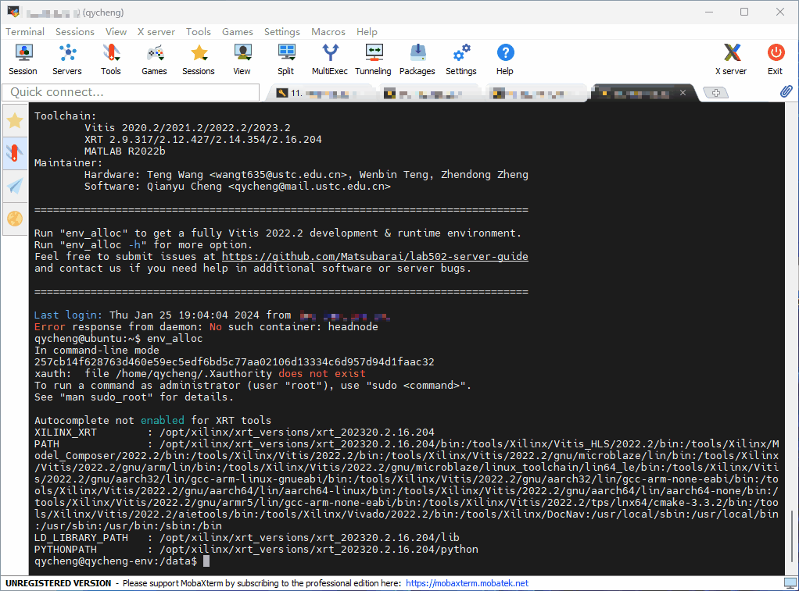

# 一些傻瓜教程
对tutorial有疑问，欢迎发issue或pull request提出。
## Step 0: 登入VPN
为了保证安全性，需要通过VPN接入服务器所在网段。请联系管理员申请VPN账号与服务器账号。
## Step 1: 登入服务器
我们建议使用SSH协议登入服务器。一般而言，VSCode/MobaXterm/Windows终端都是优秀的登入工具。以Windows终端为例。
启动Windows终端，输入以下指令，回车执行：
```powershell
ssh <USERNAME>@<SERVER IP>
```
接下来输入密码。密码不会在屏幕上显示，输入完毕后回车。


## Step 2: 分配开发环境
登入后无法直接使用完整的开发环境，你需要分配一个开发环境。

环境分配脚本支持多种使用场景。你可以根据需要执行下述指令。
### Step 2.1: 我只要命令行！
```bash
env_alloc
```
### Step 2.2: 写不惯OpenCL语法的主机端程序，我要用PYNQ，我要用Jupyter IDE！
```bash
env_alloc -p jupyter
```
你可以点击命令行输出的链接进行访问。
### Step 2.3: 我要看波形，我要看综合报告，我要用图形化界面！
```bash
env_alloc -p vnc
```
你可以点击命令行输出的链接进行访问。在非必要的情况下使用该功能可能会影响性能。


### Step 2.4: 我写完了设计，完成了仿真，要上板进行测试！
**Note: 使用板卡前请联系管理员，确认板卡使用情况！！！**

完成上板测试后请及时释放环境。附带板卡的环境，将在分配3个小时后释放。
```bash
env_alloc -d <ID> [OTHER OPTION]
```
可以通过 `xbutil examine` 查询所附带板卡的情况。
### Step 2.5: 我已经分配了环境，但是由于我自己主动退出、SSH超时断连、实验室断网、断电等原因退出了环境。我还想继续使用之前分配的环境！
执行 `env_exec` 可以返回之前已分配的环境。
## Step 3: 释放开发环境
一个用户只能分配到一个环境。在下述几种情况下，你需要主动释放环境：
- 已使用完附带板卡的环境，需要释放给其他用户使用。
- 当前环境配置需要调整。
- 在使用过程中出现致命错误。

释放开发环境前，请先确认你所需要保留的数据都已存储在/data目录。存储在其他目录的数据都将随环境释放丢失。

你需要先执行 `exit` 返回主机环境，之后执行 `env_dealloc` 指令释放。
## Step 4: 自定义环境
默认环境提供了Vitis 2022.2 & XRT 3.14.354开发环境，且已经提供了相关软件包支持，你也可以临时安装其他软件包。但是，这些执行结果都会随着环境释放而消失。

如果你需要长期使用自定义的环境，可以根据**构建脚本[模板](./Dockerfile)**，编写你所需软件包的安装流程，通过Pull requests提交到该仓库。

之后，你需要根据管理员所提供的环境镜像名，分配自定义环境。
```bash
env_alloc -i <IMAGE NAME> [OTHER OPTION]
```
该指令同样支持切换到其他版本的默认开发环境，镜像名为 `xilinx-u280:{2020.2|2021.2|2022.2|2023.2}`。

**Note: 未测试，可能会导致问题，不推荐！！！**
